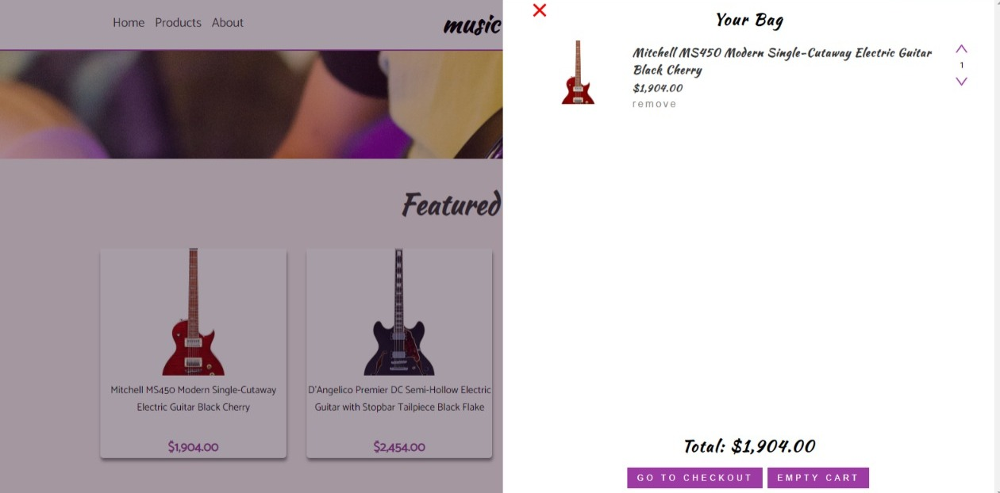
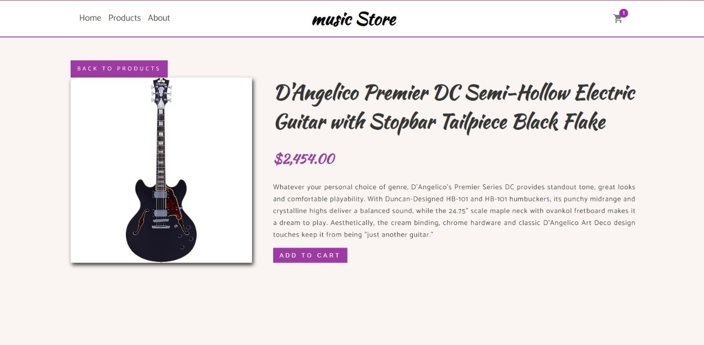
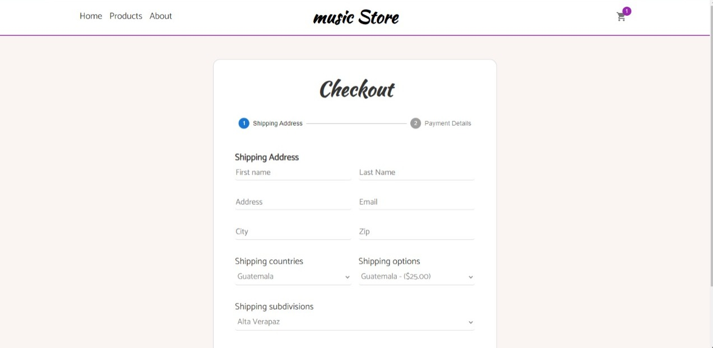
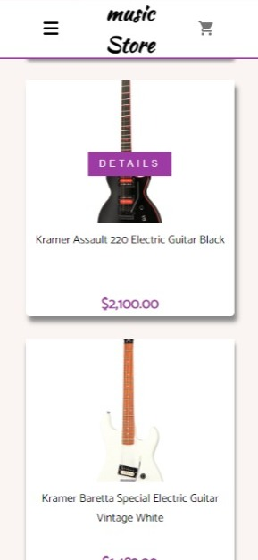
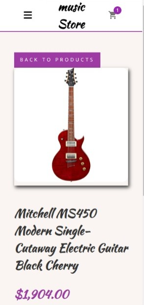
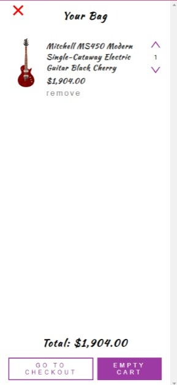
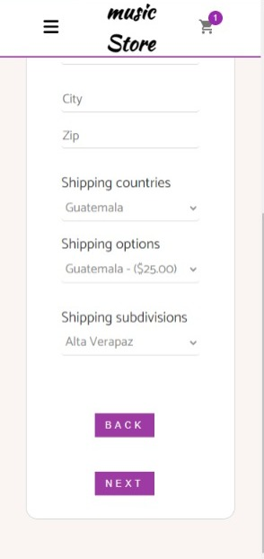

# SHAREME APP

This is e-commerce where you can buy any instrument you want, it has filters to look for the instrument, also it has a checkout to make the payment of the instrument. It has been made with the e-commerce js library, react js, stripe js , react-router-dom@6, redux, CSS, and BEM methodology

npm install to add node modules and libraries - npm start to run this proyect

- React JS
- Stripe js
- commerce JS library
- Hooks
- Redux
- React router dom
- CSS

## Desktop Version

## Mobile Version

